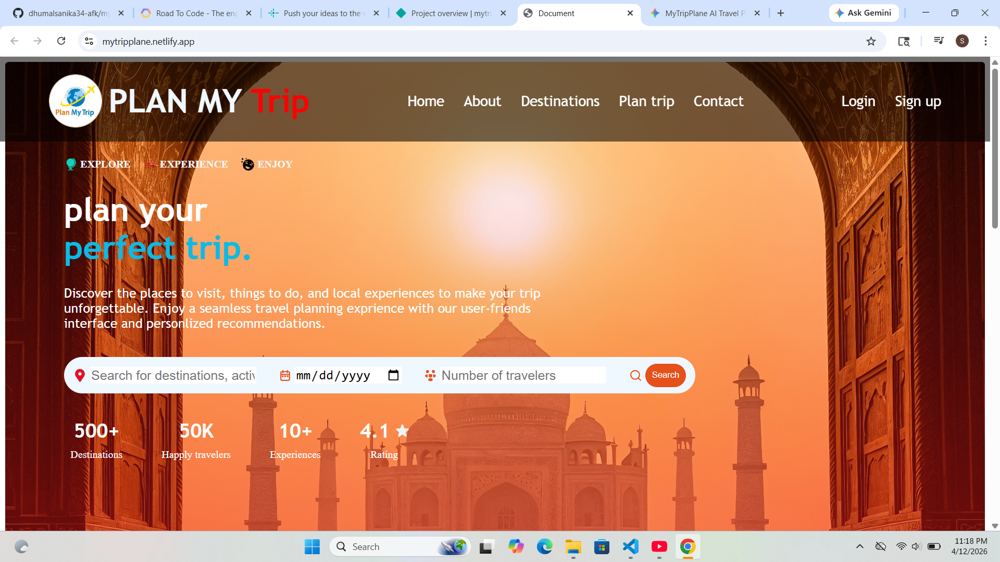
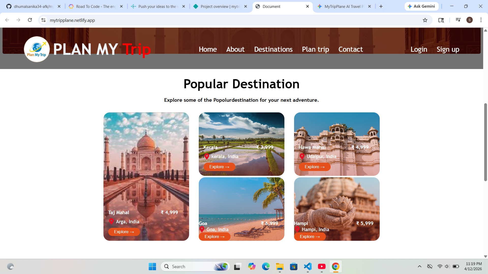
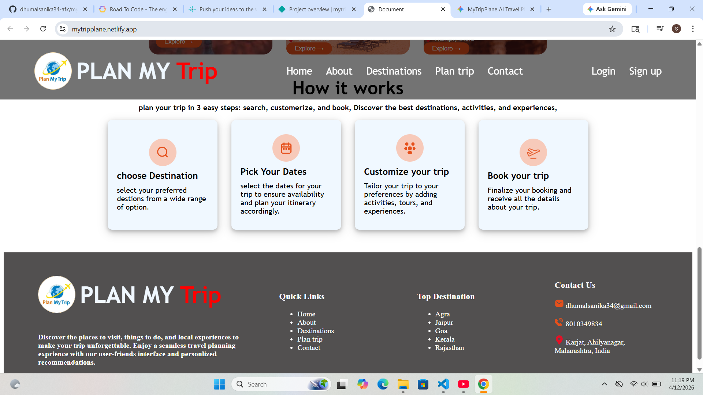
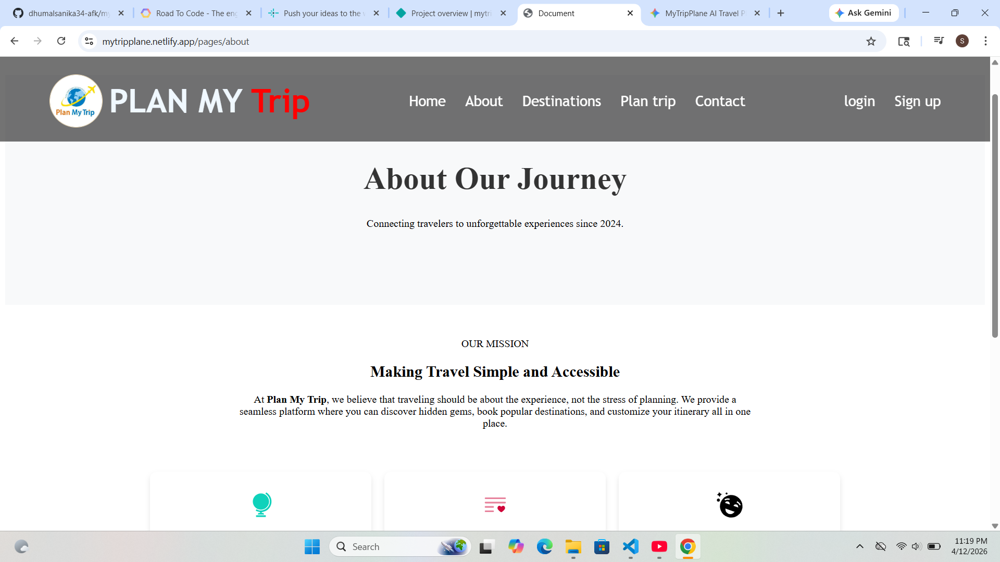
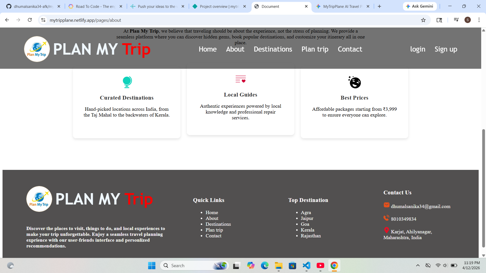
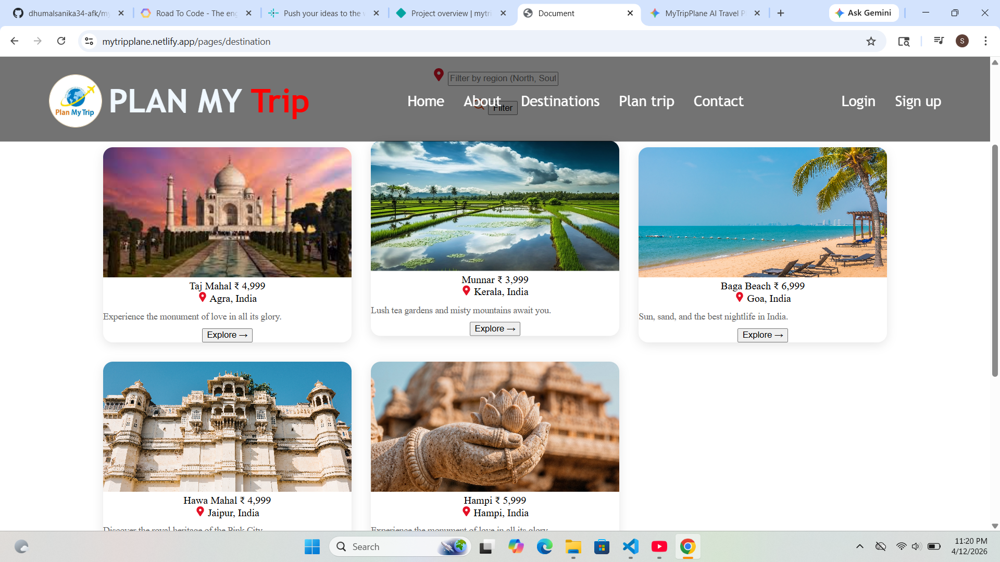
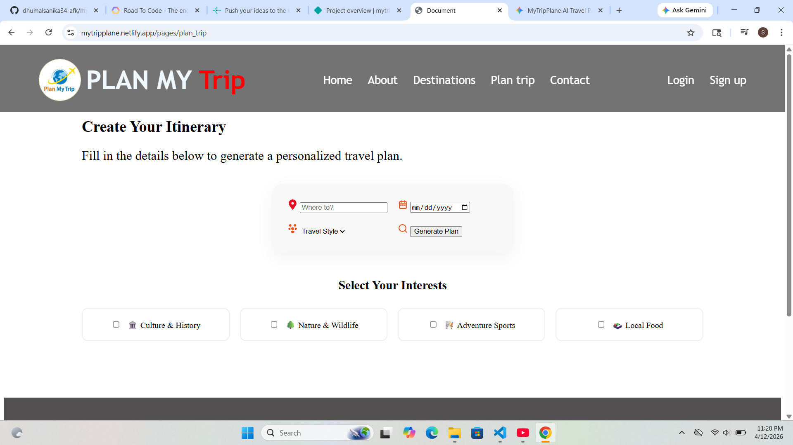
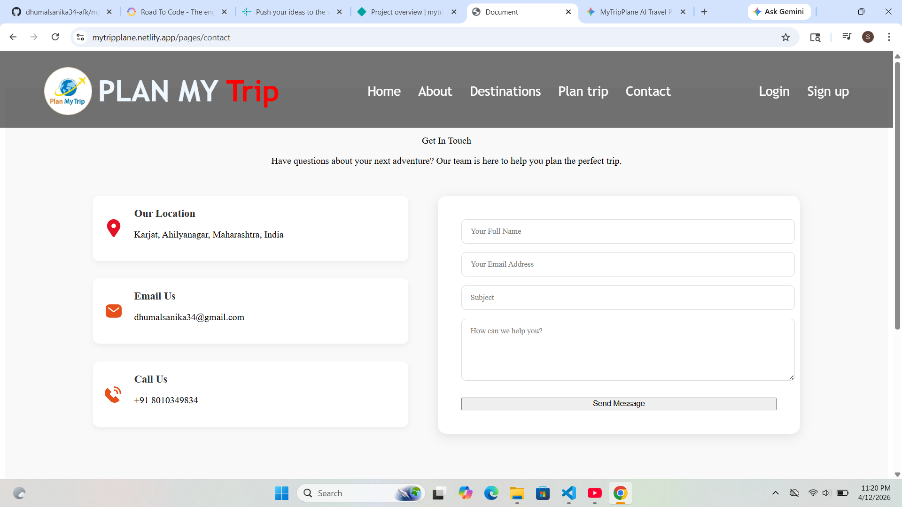
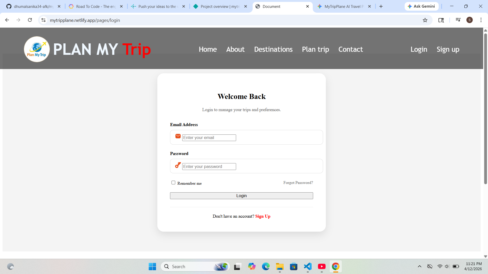
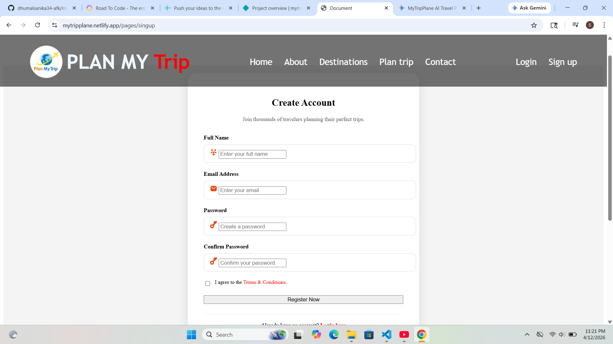

# Plan My Trip 🌍

**Plan My Trip** is a comprehensive travel planning web application designed to help users discover, customize, and book their perfect vacations. Whether you're looking for historical landmarks, beach getaways, or cultural experiences, this platform provides personalized recommendations and a seamless planning interface.

🔗 **Live Demo:** [mytripplane.netlify.app](https://mytripplane.netlify.app/)
**Output**











## 🚀 Features

- **Destination Discovery:** Explore over 500+ popular destinations including the Taj Mahal, Kerala, Goa, and more.
- **Personalized Itineraries:** Tailor your trip based on your preferred dates and travel group size.
- **Easy 4-Step Process:**
    1. **Choose Destination:** Select from a wide range of global locations.
    2. **Pick Dates:** Select your travel window for availability.
    3. **Customize:** Add specific activities and tours to your schedule.
    4. **Book:** Finalize your trip and receive full itinerary details.
- **User Authentication:** Secure Login and Sign-up system for saving travel plans.
- **Responsive Design:** Fully optimized for all screen sizes (Mobile, Tablet, Desktop).

## 🛠️ Tech Stack

- **Frontend:** HTML5, CSS3
- **Deployment:** Netlify
- **UI Design:** Modern SVG-based iconography and clean geometric layouts.

## 📂 Project Structure

```text
├── images/             # UI assets, icons, and logos
├── pages/              # Sub-pages
│   ├── about.html      # Information about the platform
│   ├── destination.html # Catalog of travel spots
│   ├── plan_trip.html  # Trip configuration form
│   ├── login.html      # User authentication
│   └── signup.html     # New user registration
├── index.html          # Main landing page
└── style.css           # Custom styling and layout